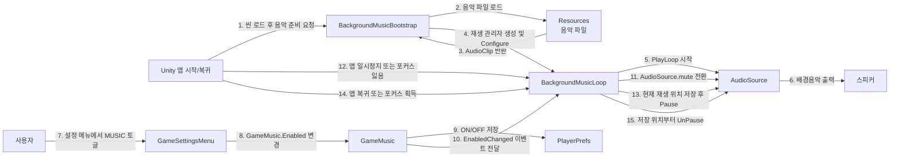

# Music Output Module - Communication Diagram

이 문서는 배경음악이 준비되고, 재생되고, 설정 변경과 앱 일시정지에 반응하는 메시지 흐름을 간단히 보여줍니다.

## 핵심 시나리오

- 게임이 시작되면 음악 재생기가 없을 경우 자동으로 만들어집니다.
- 음악 재생기는 음악 파일을 받아 `AudioSource`로 재생합니다.
- 사용자가 설정 메뉴에서 음악을 끄거나 켜면 저장값이 바뀌고, 재생 중인 음악은 즉시 음소거 상태만 바뀝니다.
- 앱이 백그라운드로 가면 재생 위치를 기억하고 멈췄다가, 복귀하면 같은 위치에서 이어서 재생합니다.

## 관련 코드

- `Assets/Scripts/Audio/BackgroundMusicLoop.cs`
- `Assets/Scripts/Audio/GameMusic.cs`
- `Assets/Scripts/Platform/GameSettingsMenu.cs`
- `Assets/Resources/Music/first_castle.mp3`
