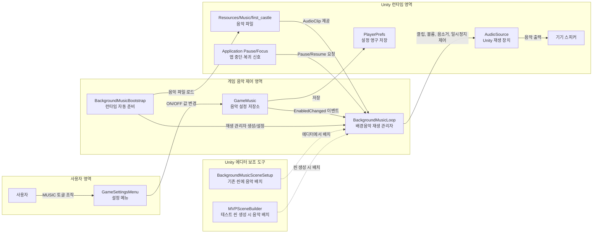

# Music Output Module - Component Diagram

이 문서는 게임의 배경음악 송출 구조를 도메인 지식이 없어도 이해할 수 있도록 추상화한 컴포넌트 다이어그램입니다.

## 핵심 요약

- `BackgroundMusicBootstrap`은 씬에 음악 재생기가 없을 때 자동으로 배경음악 재생기를 준비합니다.
- `BackgroundMusicLoop`는 실제 재생 흐름을 관리합니다. 음악을 켜고, 끝부분에서 작게 줄이고, 다시 반복합니다.
- `GameMusic`은 음악 ON/OFF 설정을 저장하고 변경 이벤트를 보냅니다.
- `GameSettingsMenu`는 사용자가 음악 설정을 바꾸는 화면 진입점입니다.
- Unity의 `AudioSource`가 최종적으로 스피커로 나갈 소리를 재생합니다.

## 관련 코드

- `Assets/Scripts/Audio/BackgroundMusicLoop.cs`
- `Assets/Scripts/Audio/GameMusic.cs`
- `Assets/Scripts/Platform/GameSettingsMenu.cs`
- `Assets/Editor/BackgroundMusicSceneSetup.cs`
- `Assets/Editor/MVPSceneBuilder.cs`
- `Assets/Resources/Music/first_castle.mp3`
